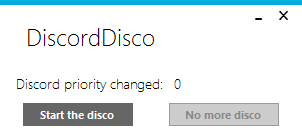

# Discord-Disco
## TL;DR
This tool sets the Discord priority from low to high and sometimes farts.

## Long version
This little tool started out as a quick and fun solution for a common issue a friend had with Discord. 
Every time you minimize Discord it sets its own CPU priority to low and your voice chat would start lagging when you're playing a game or anything else would use a lot of CPU resources.
Discord-Disco will, once started, scan the various Discord processes every 5 seconds for any one that has a CPU priority set of _low_. The counter will increase by one every time Discord priority was changed.
The executable is rather larger due to the embedded sound file and MetroFramework libraries.

If you're curious (or paranoid - which is totally fine with executables requiring administrative permissions), [here's the VirusTotal scan of the executable](https://www.virustotal.com/gui/file/211a1aa70b06c696d52d890e9771bfbff40cc49b4b952fcf5f5d8d76a15a9ac2/detection)

# Usage
Download the .exe from the [releases](https://github.com/tryallthethings/Discord-Disco/releases) to any place you like and start. If your PC has UAC enabled (which any Windows PC has by default) you'll see one or several warnings (depending on your Windows version) which you need to accept. Discord-Disco requires to be run with administrative permissions to be able to set the CPU priority of other processes.
Once you press the button "Start the Disco" it will start doing its thing. "Stop the disco" or closing the app will stop it.
Fart sound has a 50% chance of triggering if the tool set the priority successful. :smirk:

I'll release version without fart sound but with additional options later and link it here.

# Resources used in this project
- App Icon: https://emoji.gg/emoji/1587_Derp
- Fart sound: https://www.myinstants.com/instant/fart-button/
- MetroFramework Modern UI: https://github.com/dennismagno/metroframework-modern-ui
